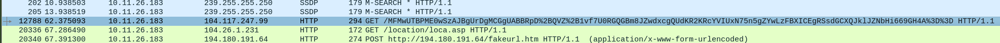

# Nemotodes Infection Analysis – November 2024

##  Summary
Captured malware traffic from a medical research facility showing signs of early-stage infection and C2 callbacks.

##  Key IOCs
- External IP: `104.117.247.99`
- Internal Victim IP: `10.11.26.183`
- Suspicious HTTP Request: Base64-style GET traffic

##  Detection Strategy
- Alert on encoded HTTP URIs
- Flag outbound traffic to low-reputation IPs

## False Positive – OCSP Certificate Check

During the analysis of packet #12788, an outbound HTTP GET request to r10.o.lencr.org appeared suspicious due to:

-A long, Base64-style URI

-External IP communication (104.117.247.99)

-Minimal payload size

However, upon investigation, this traffic was identified as part of a standard Online Certificate Status Protocol (OCSP) check initiated by the Windows host (Microsoft-CryptoAPI/10.0 user-agent).

The response headers confirmed this was a legitimate certificate validation:

Content-Type: application/ocsp-response
Server: nginx
Host: Let's Encrypt
This finding emphasizes the importance of context in SOC investigations — encoded traffic and external requests can mimic malicious behavior, but not all anomalies are threats.

*Figure 1: Encoded HTTP request to Let's Encrypt OCSP server. Legitimate traffic misidentified as potential C2.*

##  Mitigation
- Patch systems, restrict outbound traffic, segment network zones
