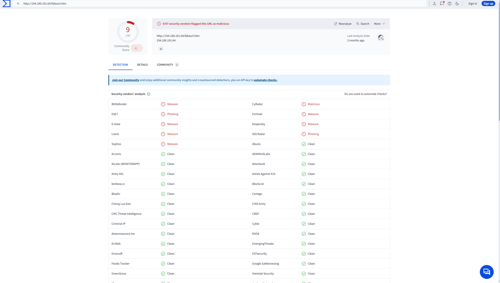

# Nemotodes Infection Analysis – November 2024

## Preliminary Finding
Captured malware traffic from a medical research facility showing signs of early-stage infection and C2 callbacks.

##  Key IOCs
- External IP: `104.117.247.99`
- Internal Victim IP: `10.11.26.183`
- Suspicious HTTP Request: Base64-style GET traffic

##  Detection Strategy
- Alert on encoded HTTP URIs
- Flag outbound traffic to low-reputation IPs

## False Positive – OCSP Certificate Check

During the analysis of packet #12788, an outbound HTTP GET request to r10.o.lencr.org appeared suspicious due to:

-A long, Base64-style URI

-External IP communication (104.117.247.99)

-Minimal payload size

However, upon investigation, this traffic was identified as part of a standard Online Certificate Status Protocol (OCSP) check initiated by the Windows host (Microsoft-CryptoAPI/10.0 user-agent).

The response headers confirmed this was a legitimate certificate validation:

Content-Type: application/ocsp-response
Server: nginx
Host: Let's Encrypt
This finding emphasizes the importance of context in SOC investigations — encoded traffic and external requests can mimic malicious behavior, but not all anomalies are threats.

*Figure 1: Encoded request sent to Let's Encrypt OCSP server by Windows host.*

##  Mitigation
- Patch systems, restrict outbound traffic, segment network zones

## Initial Sweep & Detection Filters
The analysis began with a broad sweep using the following Wireshark filters:

plaintext
http.request || tls.handshake.extensions_server_name
This revealed:

Multiple encrypted TLS sessions to known Microsoft services (legit)

One standout anomaly: a base64-style encoded HTTP GET to 104.117.247.99

 Suspicion Trigger: Encoded GET Request
That suspicious request didn't match standard Windows telemetry:

It wasn’t part of certificate validation or OCSP traffic

The IP wasn't affiliated with Microsoft

The URI looked obfuscated or encoded

This flagged 10.11.26.183 — the internal host — as potentially compromised.

 Pivot: Searching for More Outbound Behavior
After tracing outbound activity from that host, we expanded filtering to inspect all HTTP traffic, including plain requests not wrapped in TLS. This surfaced the following outbound request:

http://194.180.191.64/fakeurl.htm

*Figure X: VirusTotal detection showing multiple engines flagging NetSupport RAT indicators linked to suspicious URL.*

This endpoint is linked to NetSupport Manager RAT operations and known malware campaigns.

 Confirmation
Packet analysis showed:

No encryption (plain HTTP)

Host 10.11.26.183 reaching out to a confirmed C2 server

No headers resembling legitimate telemetry

